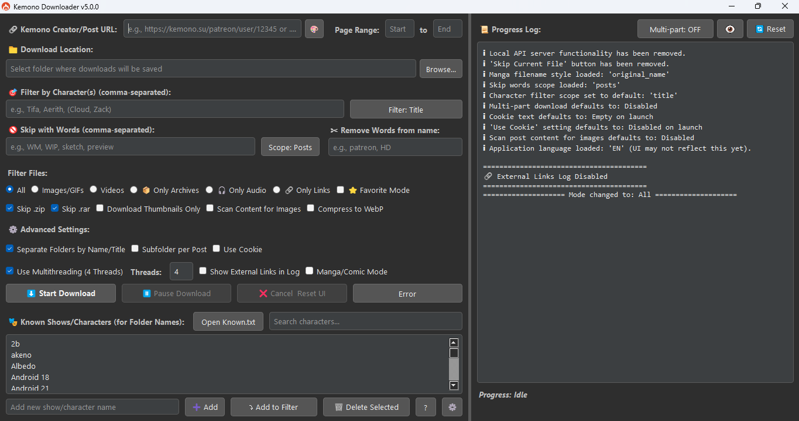
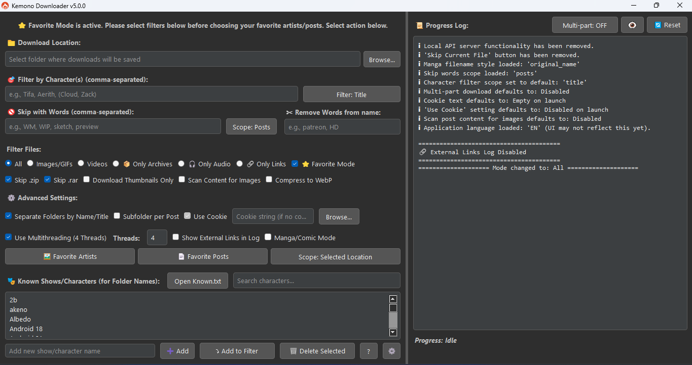
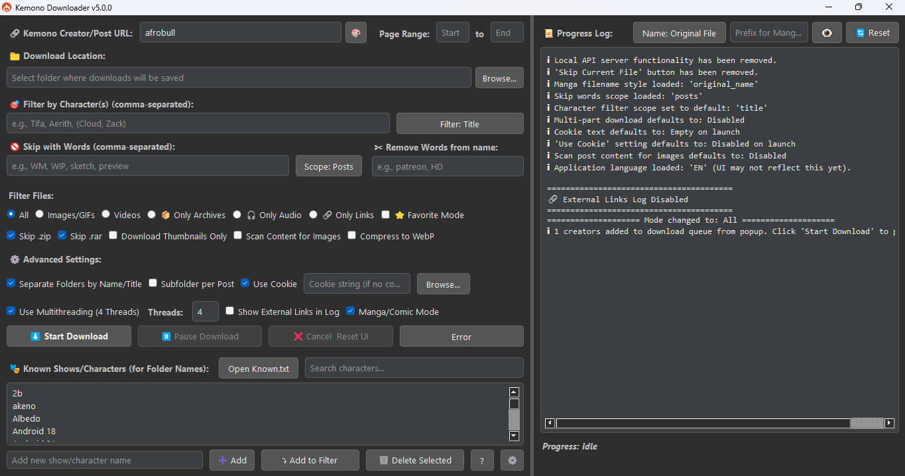
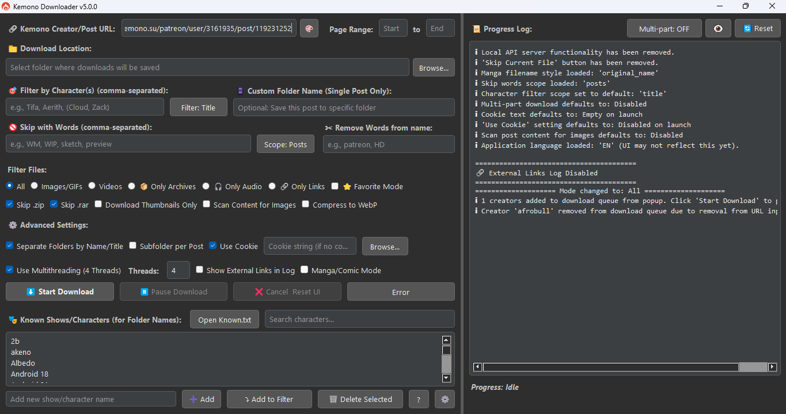

<h1 align="center">Kemono Downloader</h1>

  <table>
    <tbody>
      <tr>
        <td align="center">
           
          <strong>Default Mode</strong>
        </td>
        <td align="center">
           
          <strong>Favorite Mode</strong>
        </td>
      </tr>
      <tr>
        <td align="center">
           
          <strong>Single Post</strong>
        </td>
        <td align="center">
           
          <strong>Manga/Comic Mode</strong>
        </td>
      </tr>
    </tbody>
  </table>

A powerful, feature-rich GUI application for downloading content from a wide array of sites, including <strong>Kemono</strong>, <strong>Coomer</strong>, <strong>Bunkr</strong>, <strong>Erome</strong>, <strong>Saint2.su</strong>, and <strong>nhentai</strong>.

Built with PyQt5, this tool is designed for users who want deep filtering capabilities, customizable folder structures, efficient downloads, and intelligent automation — all within a modern and user-friendly graphical interface.

    
    
    

<h2>Core Capabilities Overview</h2>
<h3>High-Performance &amp; Resilient Downloading</h3>
<ul>
  <li><strong>Multi-threading:</strong> Processes multiple posts simultaneously to greatly accelerate downloads from large creator profiles.</li>
  <li><strong>Multi-part Downloading:</strong> Splits large files into chunks and downloads them in parallel to maximize speed.</li>
  <li><strong>Session Management:</strong> Supports pausing, resuming, and <strong>restoring downloads</strong> after crashes or interruptions, so you never lose your progress.</li>
</ul>
<h3>Expanded Site Support</h3>
<ul>
  <li><strong>Direct Downloading:</strong> Full support for Kemono, Coomer, Bunkr, Erome, Saint2.su, and nhentai.</li>
  <li><strong>Batch Mode:</strong> Download hundreds of URLs at once from <code>nhentai.txt</code> or <code>saint2.su.txt</code> files.</li>
  <li><strong>Discord Support:</strong> Download files or save entire channel histories as PDFs directly through the API.</li>
</ul>
<h3>Advanced Filtering &amp; Content Control</h3>
<ul>
  <li><strong>Content Type Filtering:</strong> Select whether to download all files or limit to images, videos, audio, or archives only.</li>
  <li><strong>Keyword Skipping:</strong> Automatically skips posts or files containing certain keywords (e.g., "WIP", "sketch").</li>
  <li><strong>Skip by Size:</strong> Avoid small files by setting a minimum size threshold in MB (e.g., <code>[200]</code>).</li>
  <li><strong>Character Filtering:</strong> Restricts downloads to posts that match specific character or series names, with scope controls for title, filename, or comments.</li>
</ul>
<h3>Intelligent File Organization</h3>
<ul>
  <li><strong>Automated Subfolders:</strong> Automatically organizes downloaded files into subdirectories based on character names or per post.</li>
  <li><strong>Advanced File Renaming:</strong> Flexible renaming options, especially in Manga Mode, including by post title, date, sequential numbering, or post ID.</li>
  <li><strong>Filename Cleaning:</strong> Automatically removes unwanted text from filenames.</li>
</ul>
<h3>Specialized Modes</h3>
<ul>
  <li><strong>Manga/Comic Mode:</strong> Sorts posts chronologically before downloading to ensure pages appear in the correct sequence.</li>
  <li><strong>Favorite Mode:</strong> Connects to your account and downloads from your favorites list (artists or posts).</li>
  <li><strong>Link Extraction Mode:</strong> Extracts external links (Mega, Google Drive) from posts for export or <strong>direct in-app downloading</strong>.</li>
  <li><strong>Text Extraction Mode:</strong> Saves post descriptions or comment sections as <code>PDF</code>, <code>DOCX</code>, or <code>TXT</code> files.</li>
</ul>
<h3>Utility &amp; Advanced Features</h3>
<ul>
  <li><strong>In-App Updater:</strong> Check for new versions directly from the settings menu.</li>
  <li><strong>Cookie Support:</strong> Enables access to subscriber-only content via browser session cookies.</li>
  <li><strong>Duplicate Detection:</strong> Prevents saving duplicate files using content-based comparison, with configurable limits.</li>
  <li><strong>Image Compression:</strong> Automatically converts large images to <code>.webp</code> to reduce disk usage.</li>
  <li><strong>Creator Management:</strong> Built-in creator browser and update checker for downloading only new posts from saved profiles.</li>
  <li><strong>Error Handling:</strong> Tracks failed downloads and provides a retry dialog with options to export or redownload missing files.</li>
</ul>
<h2>💻 Installation</h2>
<h3>Requirements</h3>
<ul>
  <li>Python 3.6 or higher</li>
  <li>pip (Python package installer)</li>
</ul>
<h3>Install Dependencies</h3>
<pre><code>pip install PyQt5 requests cloudscraper Pillow fpdf2 python-docx
</code></pre>
<h3>Running the Application</h3>

Navigate to the application's directory in your terminal and run:

<pre><code>python main.py
</code></pre>
<h2>Contribution</h2>

Feel free to fork this repo and submit pull requests for bug fixes, new features, or UI improvements!

<h2>License</h2>

This project is under the MIT Licence

<h2>Star History</h2>
<table align="center" style="border-collapse: collapse; border: none; margin-left: auto; margin-right: auto;">
  <tbody>
    <tr>
      <td align="center" valign="middle" style="padding: 10px; border: none;">
        
      </td>
    </tr>
  </tbody>
</table>

  

